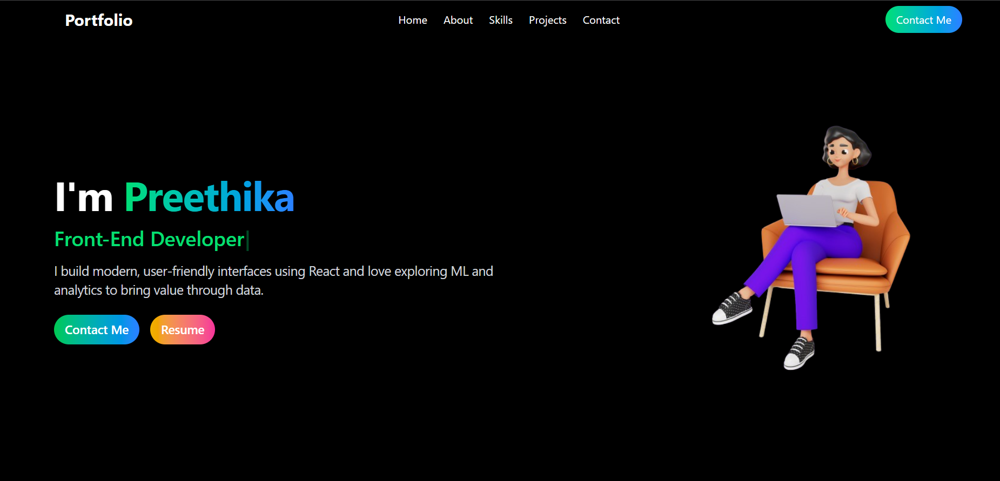

# Portfolio Website (React + Vite)

A clean, responsive, and animated portfolio website built using **React**, **Tailwind CSS**, and **Framer Motion** with **Vite**. This site showcases projects, skills, and a contact form powered by **EmailJS** for real-time communication.



## ✨ Features

- Fully responsive layout
- Animated project cards with flip effects
- Scroll-based reveal animations
- Skill icons with hover effects
- Contact form integrated with EmailJS
- Dark theme for a modern look

## 🛠️ Tech Stack

- React
- Vite
- Tailwind CSS
- Framer Motion
- EmailJS

🌐 Live Preview
## Live Demo


## 🚀 Getting Started

To run the portfolio locally:

1.Clone the Repository

```bash
git clone https://github.com/yourusername/portfolio.git
cd portfolio

2. Install Dependencies
npm install

3. Start the Development Server
npm run dev

Then open your browser at http://localhost:5173.

📂 Folder Structure
src/
├── assets/         # Images (including screenshot, icons)
├── components/     # React components like Navbar, About, Projects, etc.
├── App.jsx         # Main app layout
├── main.jsx        # Entry point
└── index.css       # Tailwind CSS styles


📬 Contact Form Setup (EmailJS)
1.Create an account at EmailJS

2.Create a new email service and template

3.Add the following to your .env file:
    VITE_EMAILJS_SERVICE_ID=your_service_id
    VITE_EMAILJS_TEMPLATE_ID=your_template_id
    VITE_EMAILJS_PUBLIC_KEY=your_public_key

4.Test the contact form to confirm it's sending emails.


⭐ Give a Star
If you like this project, hit on ⭐(./src/assets/webstars.jpg)
